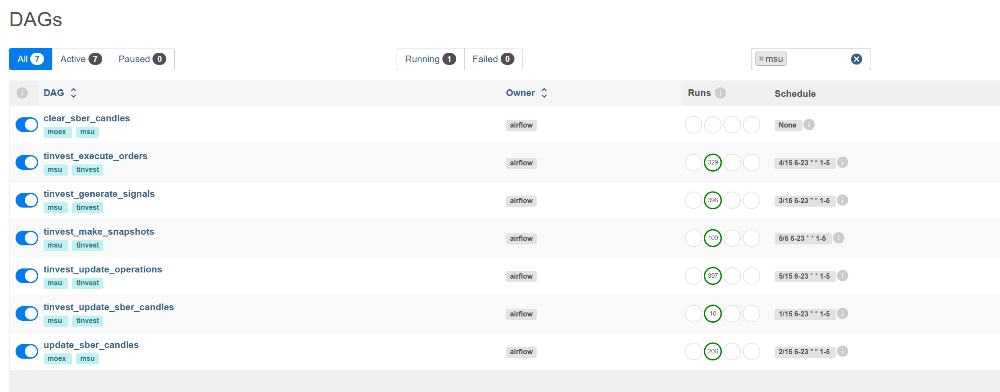
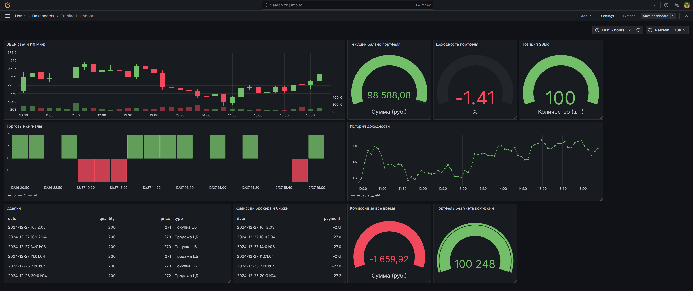

# vertr-drl

Демонстрация возможностей алгоритмов DRL в торговле на бирже. 

## Установка и старт

### Развернуть контейнеры инфрастуктуры

```shell
cd infra
docker-compose up -d
```

### Развернуть базы данных

#### Создать таблицы в БД postgres запуском скриптов из каталога database

- moex_candles.sql
- operations.sql
- orders.sql
- portfolio_snapshots.sql
- position-snapshots.sql
- signals.sql
- trades.sql
- tinvest_candles.sql

#### Создать БД для AirFlow  

```yaml
POSTGRES_USER: airflow
POSTGRES_PASSWORD: airflow
POSTGRES_DB: airflow
```

#### Создать БД для OptunaDashboard

```yaml
POSTGRES_USER: postgres
POSTGRES_PASSWORD: admin
POSTGRES_DB: optunadb
```

##### Сделать видимой БД для AirFlow и Optuna Dashboard

```shell
docker network connect airflow_default infra-pgsql-1
docker network connect optimization infra-pgsql-1
```

### Прописать креденшилы доступа к бд в файле airflow/plugins/db_connection.py

### Установить креденшилы для T-invest API в  airflow/plugins/tinvest_sandbox_adapter.py

```python
_SB_TOKEN_ = '<TOKEN>'
SB_TRADING_ACCOUNT_ID = '<ACCOUNT_ID>'
SB_TESTING_ACCOUNT_ID = '<ACCOUNT_ID>'
```

Можно создать тестовый акаунт, вызвав функции класса TinvestSandboxAdapter:

- open_sandbox_account
- deposit_sandbox_account


### Собрать и запустить Apache AirFlow

```shell
cd airflow
docker-compose build
docker-compose up -d
```
Дождаться загрузки исторических данных по расписанию или запустить DAG вручную: tinvest_update_sber_candles.py

###  Собрать и запустить Optuna dashboard (опционально)
```shell
cd optimization
docker-compose up -d
```

### Обучить модель DRL

Запустить скрипт обучения модели, указав в аргументах название алгоритма:

```shell
cd training 
python model_trainer_main.py dqn
```

Поддерживаемый набор алгоритмов: a2c, ddpg, dqn, ppo, sac, td3, ars, qrdqn, tqc, trpo, ppo_lstm

Процесс обучения можно наблюдать в TensorBoard:

```shell
cd training 
tensorboard --logdir logs
```

На выходе - zip файл с обученной моделью в каталоге  training/models

### Запустить генерацию сигналов 

Обученную zip модель нужно поместить в airflow/dags/models

В DAG-е генерации сигналов нужно явно указать алгоритм для использвания:

```python
generate_signals_1min_of15 = PythonOperator(
    task_id='generate_signals_1min_of15',
    python_callable=generate_signal,
    dag=dag,
    op_kwargs={
        'db_connection': DbConnection.airflow_db_connection(),
        'algo_name': 'dqn',
        'instrument': Instrument.get_instrument("SBER"),
        'interval': Interval.hour_1,
    },
)
```

### Контроль работы 

Можно наблюдать за работой DAG-ов: [http://localhost:8080](http://localhost:8080/)



Или мониторить торговлю в реальном времени через Grafana Dashboard: [http://localhost:3000](http://localhost:3000/)




